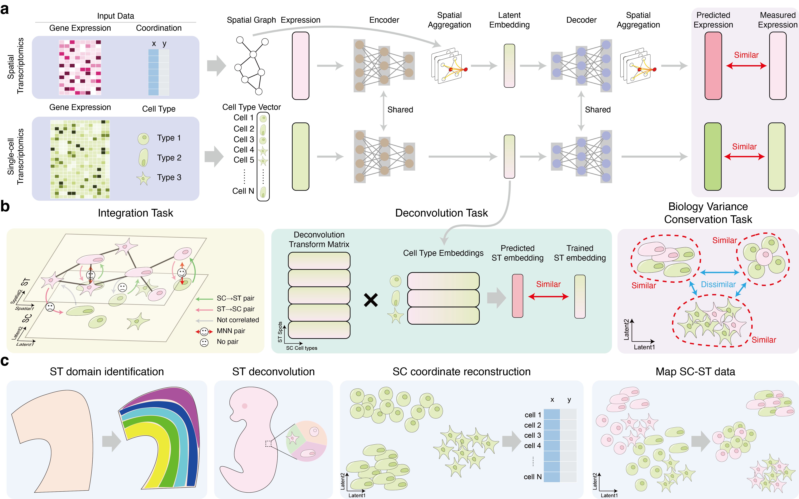

# stSCI
[](https://stsci.readthedocs.io/en/latest/?badge=latest)

 

## Overview 
Spatial transcriptomics (ST) data reveals the locations of transcriptomes, offering crucial perspectives but at a compromised quality. Integrating ST data with single-cell transcriptomics (SC) data has proven to be an effective strategy for enhancing the quality of ST data, as demonstrated by previous research. We introduce stSCI (ST-SC Integration), a novel computational method that seamlessly fuses SC and ST data into a unified embedding space by incorporating a newly designed fusion module. Utilizing several simulated and real datasets, stSCI demonstrates its performance in batch correction across the two omics data, in clustering, and deconvolution of ST data, as well as in reconstructing spatial coordinates for SC data. Additionally, stSCI shows its potential for annotating ST data using only marker genes and cell types derived from SC data. Moreover, experiment result shows that stSCI performing well with both sequencing-based and imaging-based ST data, highlighting its capability as a powerful tool for comprehensive biological system analysis.


## Software dependencies
<details open>
<div>python==3.10.13</div>
<div>numpy==1.26.4</div>  
<div>pandas==2.2.2</div>
<div>matplotlib==3.8.2</div>
<div>scanpy==1.10.1</div>
<div>squidpy==1.4.1</div>  
<div>faiss==1.7.4</div> 
<div>igraph==0.11.5</div>  
<div>scikit-learn==1.5.0</div>  
<div>scikit-misc==0.3.1</div> 
<div>louvain==0.8.2</div>
<div>scipy==1.12.0</div>  
<div>tqdm==4.66.1</div>  
<div>pytorch==2.3.1+cu121</div>   
<div>torch_geometric==2.5.0</div>  
<div>rpy2==3.2.2</div>  
<div>R==3.6.1</div>  
<div>mclust==6.1.1</div>
</details>


## Setup stSCI
### Setup by Docker (*Recommended*):  
1. Download the stSCI image from [DockerHub](https://hub.docker.com/repository/docker/hannshu/stsci) and setup a container:
``` bash
docker run --gpus all --name your_container_name -idt hannshu/stsci:latest
```

2. Access the container:
``` bash
docker start your_container_name
docker exec -it your_container_name /bin/bash
```

3. Write a python script to run stSCI

The anaconda environment for stSCI will be automatically activate in the container. The stSCI source code is located at `/root/stSCI`, please run `git pull` to update the codes before you use.
All dependencies of stSCI have been properly installed in this container, including the mclust R package, and the conda environment stSCI will automatically activate when you run the container.

- Note: Please make sure `NVIDIA Container Toolkit` is properly installed on your host device. (Or follow this instruction to [setup NVIDIA Container Toolkit](https://docs.nvidia.com/datacenter/cloud-native/container-toolkit/latest/install-guide.html) first)


### Manually setup:  
We suggest you to use the Docker to setup and run stSCI. If you want to manually setup stSCI, we recommend you to use [Anaconda](https://docs.anaconda.com/free/anaconda/install/) to build the runtime environment.

1. Clone this repository from Github:
``` bash
git clone https://github.com/hannshu/stSCI.git
```

2. Download dataset repository:

``` bash
git submodule init
git submodule update
```

3. Build the Anaconda environment, the package version of the essential dependencies noted at [Software dependencies](#Software-dependencies) section.

4. Write a python script to run stSCI


## Tutorial
Read the [Documentation](https://stsci.readthedocs.io/en/latest/) for detailed tutorials.


<!-- ## Citation
If you have found our model useful in your work, please consider citing [our article](url):
```

``` -->